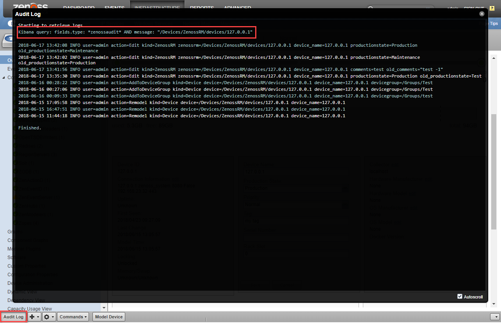

# ZenPacks.jstanley.AuditLog

AuditLog ZenPack adds a new button to the device page to pull audit logs from Kibana for that device.

## Releases
Version 1.0.0
> Released: 2018/6/18
>
> Compatible with Zenoss 6.2
>
> Requires: ZenPackLib ZenPack (https://www.zenoss.com/product/zenpacks/zenpacklib)

## Features
Additional button to the device page to pull audit logs from Kibana for that device.



### Kibana Search Information
This action performs a search using the Kibana REST API against the \_msearch uri.

#### Headers
* kbn-xsrf: reporting
* Content-Type: application/json

#### Query payload
```python
{
    "query": {
        "filtered": {
            "query": {
                "query_string": {
                    "query": "*zenossaudit* AND *device=<deviceUid>*",
                    "analyze_wildcard": True
                }
            }
        }
    },
    "size": 500,
    "sort":[
        {   
            "@timestamp": {
                "order": "desc",
                "unmapped_type":"boolean"
            }
        }
    ],
    "fields": ["message"],
    "script_fields": {},
    "fielddata_fields": ["@timestamp"]
}
```

## Usage
After installing the ZenPack, navigate to Infrastructure and at root device class level (/Devices) set the following zProperties based on your Control Center setup.
* zCCHost
* zCCPort
* zCCUser
* zCCPass
 > These settings will usually be the same you have used on your ControlCenter device under /ControlCenter

## Installed Items
### zProperties
* zCCHost
* zCCPort
* zCCUser
* zCCPass

## Changes
### 1.0.0
* Initial release.
